Scalable URL Shortener Service

A high-throughput, resilient URL Shortener microservice built with Java 21 and Spring Boot 3.2.4. Designed for ultra-low latency

redirection via Redis caching and non-blocking asynchronous analytics processing via Apache Kafka and PostgreSQL.

🌟 Key Features
Base62 URL Compression: Converts long URLs into unique, compact 7-character short codes.

Low-Latency Redirection: Implements a Cache-Aside pattern using Redis to serve root-level 302 Found redirects in sub-20ms.

Asynchronous Analytics: Decouples click-event counters via Apache Kafka (url-analytics-topic) to eliminate database write contention.

OpenAPI 3.1 & Swagger UI: Fully interactive REST API documentation generated via Springdoc.

Resilient Failure Isolation: Soft-fails Kafka/Redis connectivity drops so redirection paths remain operational.

🏗 System Architecture

  [ Client ] 
      │
      ├─── 1. POST /api/v1/urls ───────────► [ Spring Boot API ] ───► [ PostgreSQL ]

      
                                                 │
      ├─── 2. GET /{code} (Redirect) ──────────────┤
      │                                             ├───► [ Redis Cache ]
      │                                             └───► [ PostgreSQL ]

      
      └─── 3. GET /api/v1/urls/{code}/analytics ───► [ Spring Boot API ] ───► [ Kafka Consumer ] ───►[ PostgreSQL ]

      
🛠 Tech Stack

Language: Java 21

Framework: Spring Boot 3.2.4

Databases: PostgreSQL, Redis

Messaging: Apache Kafka

Documentation: OpenAPI 3.1 / Swagger UI

Containerization: Docker / Docker Compose

🚀 Visual Proof of Execution

1. Application Startup & Spring Context
   
The application boots cleanly on port 8080 with embedded Tomcat and JPA initialized.

3. Interactive Swagger UI Documentation
   
Explore and execute API calls via standard OpenAPI specifications at http://localhost:8080/swagger-ui.html.

4. Creating a Short URL (POST /api/v1/urls)
   
Accepts long target URLs and generates 7-character codes (AzUM3Wt).

5. HTTP 302 Redirection & Terminal Execution
   
Executing redirects directly updates analytics counters via background Kafka workers.

# Test HTTP 302 Redirect Response
curl -i http://localhost:8080/AzUM3Wt

5. Real-Time Kafka Analytics & Database Sync
   
Click counts update asynchronously in PostgreSQL without blocking user redirection.

PostgreSQL Real-Time Increments (url_mapping table)

Analytics Endpoint (GET /api/v1/urls/{code}/analytics)

⚡ Quick Start Guide

Prerequisites

Java 21 SDK

Maven 3.8+

Docker & Docker Compose

1. Start Infrastructure
   
Launch PostgreSQL, Redis, and Kafka instances:

docker-compose up -d

2. Build and Run Application
   

mvn clean package -DskipTests

mvn spring-boot:run

🧪 Testing

Run automated unit and integration tests:

mvn test
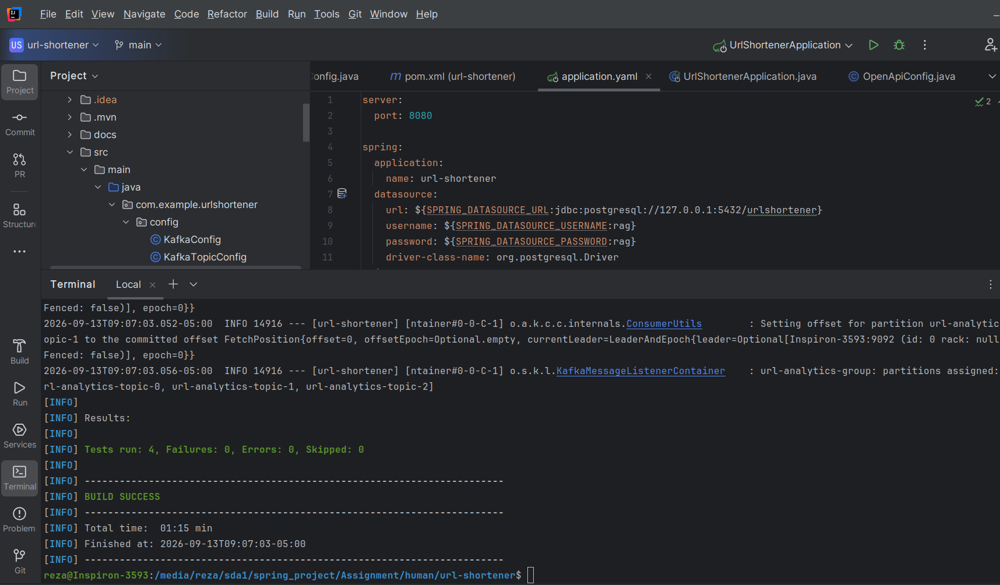

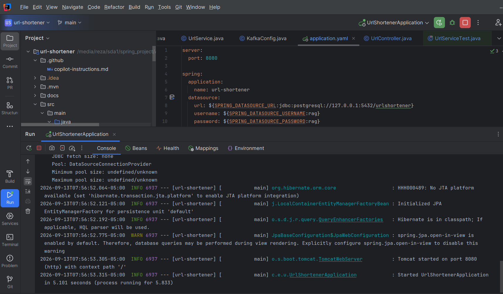
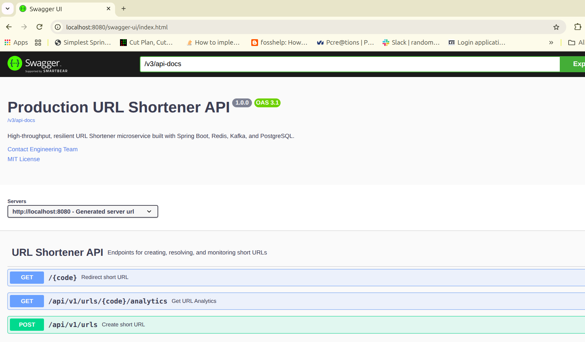
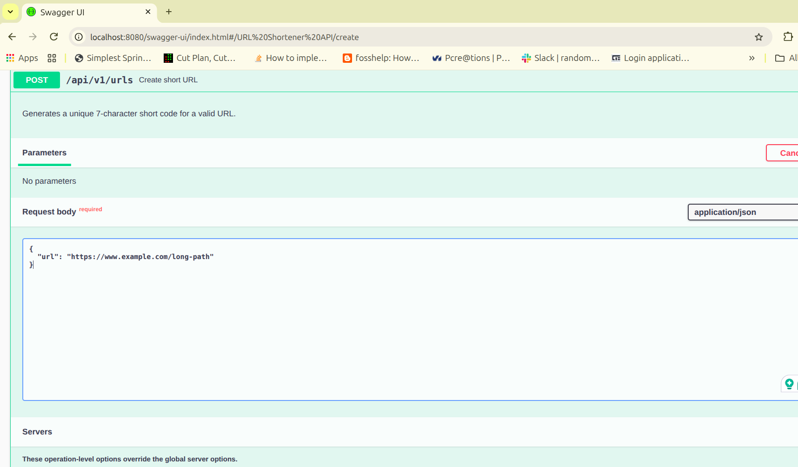
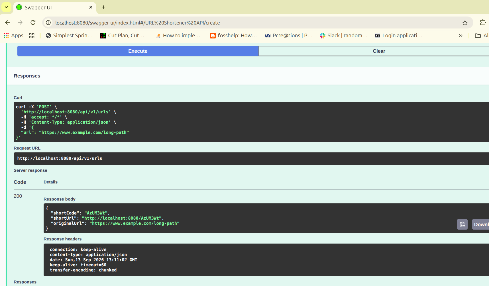
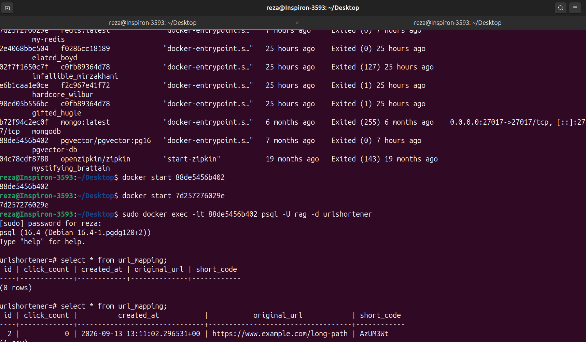
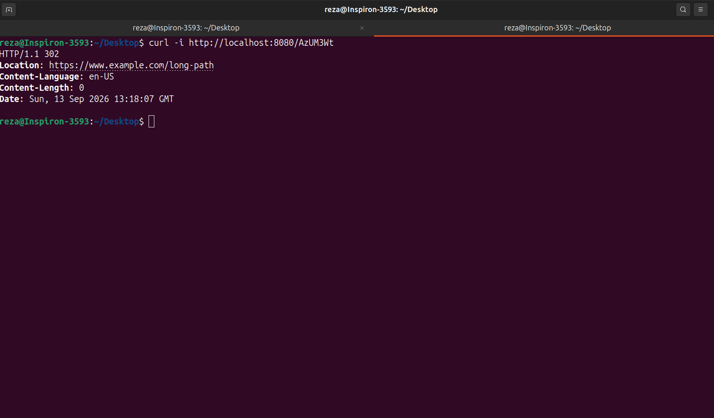
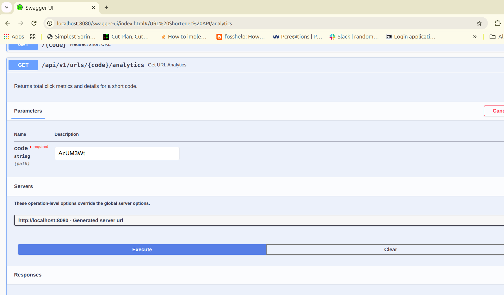
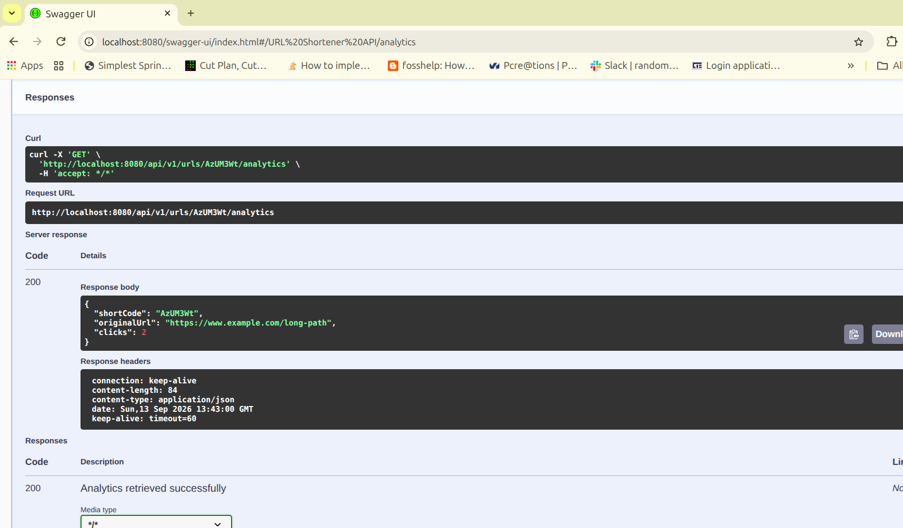
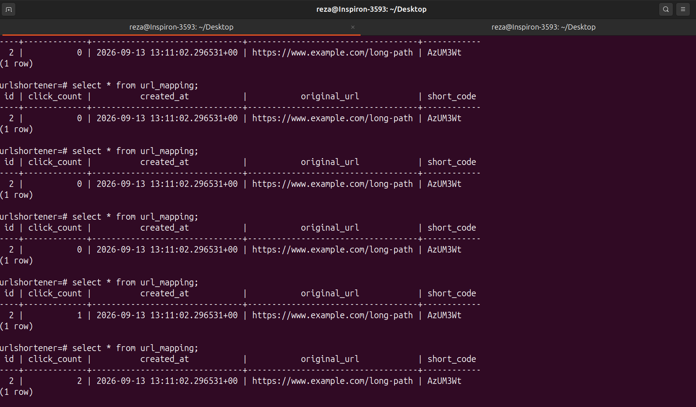
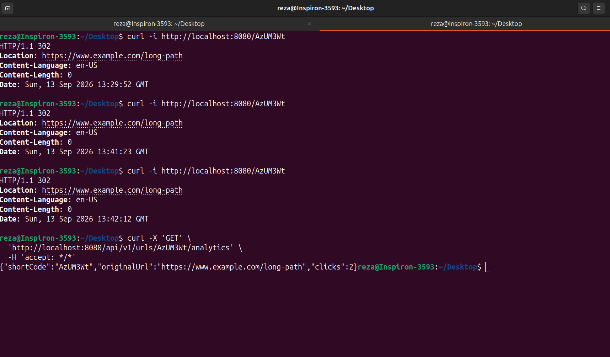

